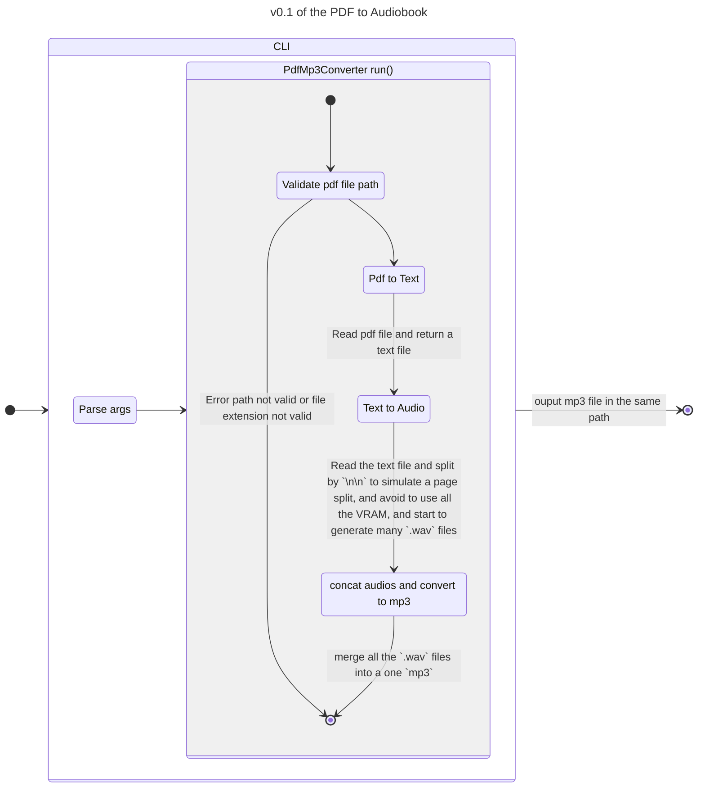
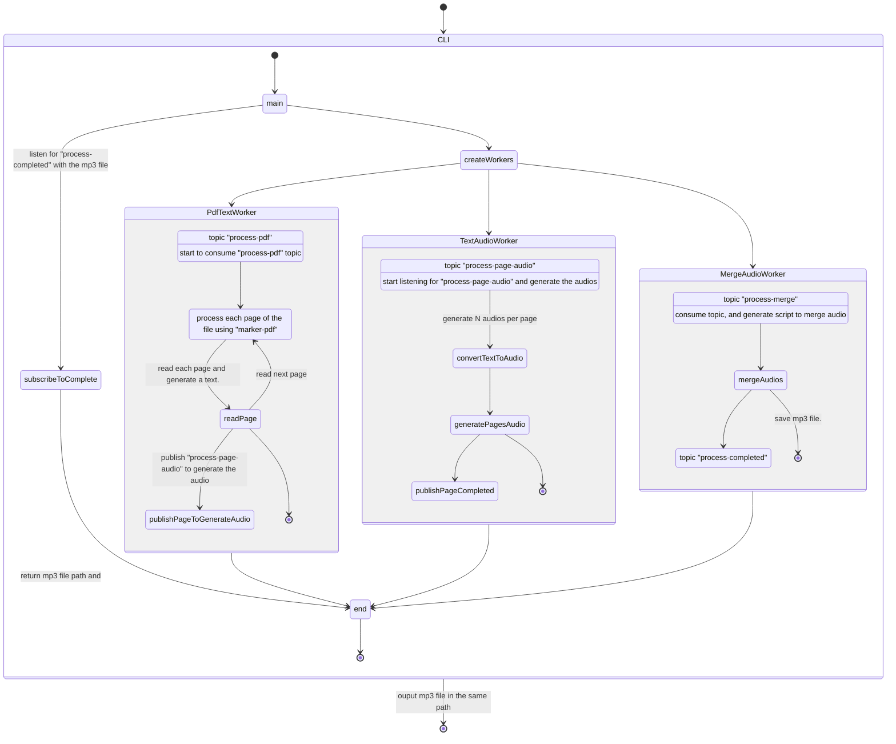
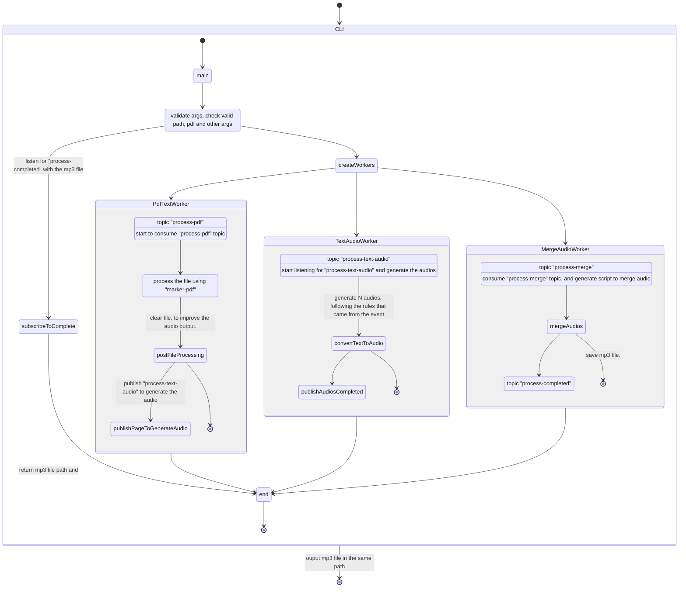

# PDF to Audiobook

This project is going to use different libraries, to read a PDF file and generate a audiobook in mp3 format.
So normal pdf libraries like `pymupdf` or `pypdf` can read, modify and do other stuff, but they cannot understand if there's a block of code. because code could be just a string with different background and font.

- [marker-pdf](https://github.com/datalab-to/marker):  
    Marker converts documents to markdown, JSON, chunks, and HTML quickly and accurately.  
    **NOTE** marker download all models at:
    `/home/{user}/.cache/datalab`
- [TTS](https://github.com/coqui-ai/TTS):  
    TTS is a library for advanced Text-to-Speech generation. 
    Coqui-TTS is the successor to Mozilla-TTS [mozilla/TTS](https://github.com/mozilla/TTS)


- [ffmpy](https://github.com/Ch00k/ffmpy):  
    ffmpy is a simple FFmpeg command line wrapper. 
    It implements a Pythonic interface for FFmpeg command line compilation and uses Python's subprocess to execute the compiled command line.

Details:
- [UV & python setup](#uv--python-setup)
- [Processing workflow](#processing-workflow)


## UV & python setup
We're using UV to create this project, if you don't have it, read the instructions [read more](https://docs.astral.sh/uv/getting-started/installation/)

### Create project from scratch
```sh
# Create a Virtual Env with UV 
uv venv --python 3.11

# Activate venv
source .venv/bin/activate

# Ruff linter
uv tool install ruff@latest
```
### Add dependencies
```sh
uv add marker-pdf[full]
uv add TTS
uv add ffmpy
uv add asyncio
uv add beautifulsoup4
uv add markdown
```

### create venv
After pulling the project, maybe you don't have the `.venv` folder.
you can create it and install all dependencies using UV
```sh
# to create the venv use
uv venv

# Then sync to install all dependencies
uv sync
```

## Processing workflow

To read and process the pdf, we use the `marker-pdf`, and will generate a markdown file.
if we try to read a markdown file with a model that was not trained to understand it, will try to said every tag, link and so on.... No really nice.
So I decide to convert the markdown file into a `txt` fila, that only will have a "```" for code blocks.
After having a clean text file, we start to use the `TTS`, but if we pass the entire file, some parts of audio could be large, and that is a lot of CPU/GPU process intensive.
So I decide to split a bit the text in many part of text and generate many small files, to make it lightweight.
and then using the `ffmpy` (ffmpeg) I merge all the `.wav` files (**TTS only use wav, more info in their description**) and convert to mp3.


### v0.1

This was a fast approach to test every component and see if the ideas was possible.
- Pro:
    - Simple and straightforward
    - not much complexity
- Cons:
    - large text can produce errors, for missing RAM.
    - not async.
    - coqui TTS have a limitation for speed, and some voices are not clear to listen for a book

### v0.2 (beta 1)
To make a faster and improve version, we can do "Event-Driven Architecture" like, making workers, and make communication between events like PubSub.
We try to use the less amount of RAM, reading by each page. by doing like "EVA", we can start to process each page individually (pdf to text, text to audio) asynchronously. 


- Pro:
    - more similar real a microservices approach
    - decoupling functionalities
- Cons:
    - running multiple LLM at the same time, also for short period of time, could produce more error for one single CPU/GPU unit.
    - reading page by page, will lost the context, and sometimes we're going to break some information, making worse the output and having issues.
    - coqui TTS have a limitation for speed, and some voices are not clear to listen for a book


### v0.2 (beta 2)
So we still want to run in async, but we need to allow to run in one CPU/GPU unit.
and also with some Cons of [v0.2 (beta 1)](#v02-beta-1), we can reuse the idea, and use the Saga (Choreography) pattern [more about Saga pattern](https://microservices.io/patterns/data/saga.html).

The approach is similar, but we run service at time.
Then we need a better post processing to the text, adding new lines or dots or something, to improve the output audio.
Add more args, to slow the speed, to only generate text, only audio

